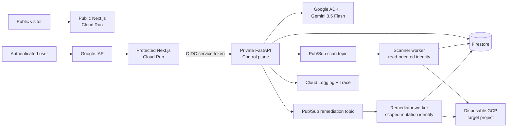

# TrustFix

> Autonomous cloud assurance that makes security answers true—and proves it.

[Public experience](https://trustfix-app-1087269593372.us-central1.run.app/) · [Protected workspace](https://trustfix-workspace-1087269593372.us-central1.run.app/app) · [Interactive demo](https://trustfix-app-1087269593372.us-central1.run.app/demo)

TrustFix is a Google ADK agent and cloud security workflow for customer security reviews. It translates natural-language requirements into deterministic controls, inspects connected Google Cloud projects, proposes the smallest safe correction, waits for the right approval, executes asynchronously, verifies the security property again, and exports cryptographic and verifiable proof.

## Why TrustFix

Traditional questionnaire automation searches documents and generates plausible text. TrustFix measures the environment behind the answer.

1. Interpret the requirement with Gemini.
2. Map it to a supported deterministic control.
3. Inspect live Google Cloud configuration.
4. Record resource-specific evidence.
5. Prepare a minimum-change remediation plan.
6. Apply policy and human approval.
7. Execute through a dedicated background worker.
8. Re-test the property independently.
9. Export the answer, evidence, approvals, and audit history.

TrustFix never marks an unsupported requirement as verified and never treats a successful mutation API call as proof that the control passes.

## Working capabilities

- Public, no-login interactive product demo.
- Google IAP-protected real workspace.
- First-login workspace provisioning and role-based access.
- Per-workspace disposable Google Cloud target selection.
- CSV and XLSX questionnaire import/export.
- Live Storage IAM, Cloud Run IAM, and firewall inspection.
- Approval-gated public-storage remediation.
- Drift fingerprint and idempotent execution.
- Anonymous post-change access verification.
- Firestore evidence, jobs, approvals, policies, and audit history.
- Pub/Sub scanner and remediator workers with separate identities.
- Command Center with assurance score and live Agent Mission Control.
- Downloadable JSON Proof Packs.
- Responsive desktop and mobile application UX.
- Cloud Trace and privacy-preserving structured logs.

## Architecture



The platform project (`trustfix-506602`) and disposable target (`trustfix-demo-target`) are intentionally separate. Browser code never receives privileged credentials.

## Technology

- Gemini 3.5 Flash on Vertex AI.
- Google Agent Development Kit and Agents CLI.
- Next.js 15 and React 19.
- FastAPI and Pydantic.
- Cloud Run.
- Firestore.
- Pub/Sub with authenticated push.
- Google IAP and Cloud IAM.
- Cloud Logging and Cloud Trace.
- Terraform infrastructure definitions.
- Vitest, Pytest, Playwright, and Agents CLI evaluation.

## Local setup

### Prerequisites

- Python 3.11+
- [uv](https://docs.astral.sh/uv/)
- Node.js 22+
- pnpm 10+
- Google Cloud SDK
- A Google Cloud project when running live checks

### Install

```powershell
uv tool install "google-agents-cli~=1.4.1"
uvx google-agents-cli setup
uv sync
pnpm install
Copy-Item .env.example .env.local
Copy-Item apps/web/.env.example apps/web/.env.local
```

*(On macOS / Linux, use `cp .env.example .env.local && cp apps/web/.env.example apps/web/.env.local`)*

The default local configuration uses development authentication, the memory adapter, and preview evidence. Do not place credentials or an OAuth client secret in `.env.local` or any `NEXT_PUBLIC_*` variable.

### Run

```powershell
# Terminal 1 — Next.js frontend (http://localhost:3000)
pnpm dev

# Terminal 2 — FastAPI backend (http://localhost:8000)
pnpm api:dev
```

Open `http://localhost:3000`.

### Agent playground

```powershell
uvx google-agents-cli playground
```

## Verification

```powershell
pnpm quality
uv run pytest tests/unit tests/integration
uvx google-agents-cli eval run
```

The agent eval suite covers supported-control mapping, unsupported requirements, refusal to fabricate a passing result, and prompt-injection resistance.

## Deployment

Production configuration is represented in `deployment/terraform/`, `.cloudbuild/`, and the root Cloud Build files. Use Secret Manager for secrets and preserve separate service identities.

```powershell
uvx google-agents-cli info
uvx google-agents-cli deploy
```

Deployment requires an authenticated Google Cloud account and explicit approval. Infrastructure scripts are located in [`infra/`](infra/).

## Security Model

- Google IAP authenticates browser users.
- The API verifies signed IAP assertions.
- Backend records are scoped by workspace.
- Owner, Admin, Security Reviewer, and Viewer roles gate actions.
- Browser requests proxy through a same-origin server route.
- Scanner and remediator identities are separated.
- Risky changes require a persisted approval.
- Idempotency prevents accidental duplicate execution.
- Drift aborts a stale plan.
- Post-change verification is independent of the mutation result.
- Prompt and response content is excluded from trace spans by default.

See [`SECURITY.md`](SECURITY.md) for responsible disclosure and implementation boundaries, and [`ARCHITECTURE.md`](ARCHITECTURE.md) for detailed service boundaries and data flow.

## Architectural Key Principles

- LLMs are valuable for interpreting ambiguous requirements, but infrastructure truth belongs in deterministic collectors and evaluators.
- Mutation success is not assurance; the original security property must be tested again.
- Human approval is more useful when the agent shows the exact change, impact, rollback, and evidence—not a generic confirmation dialog.
- A public product story and a protected operational workspace should be separate services with an explicit handoff.
- Target project isolation ensures remediation occurs safely within explicit authorized boundaries.
